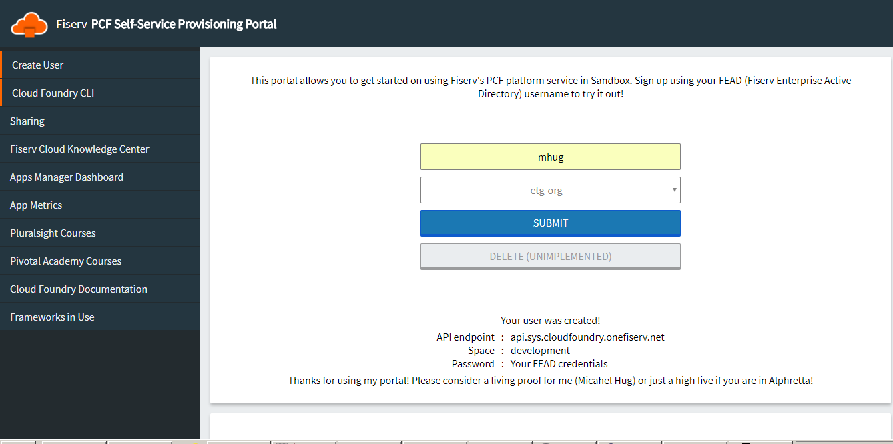

# SelfService
Create User, Space, and permissions in a cloudfoundry self service portal. Intended to be used only for non-production regions.

Environmental variables can be found in the manifest.yml

I really wanted to write this in golang, but the go-cfclient didn't have a way to create LDAP users. So i just leveraged the CF API.

